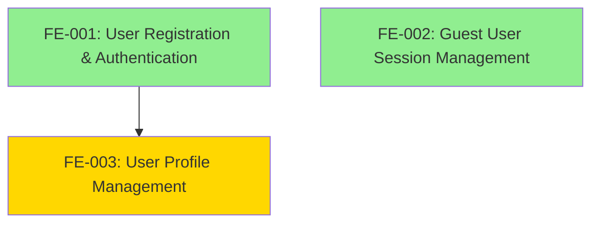

# 📘 Epic: Identity & Access Management

---

## Epic Metadata

```yaml
epic_name: "Identity & Access Management"
epic_id: "EPIC-001"
bounded_context: "Identity"
status: "draft"
owner: "Identity Team"
```

---

## Epic Overview

This epic establishes the foundational user identity and access management capabilities for itsme.fashion. It enables users to create accounts, authenticate, manage profiles, and shop as guests with persistent sessions.

**Strategic Importance:**
- Foundational capability required for all personalized features
- Enables repeat customer tracking (KPI-005: 35% repeat purchase rate)
- Supports both guest and authenticated shopping journeys
- Critical for security, privacy, and user trust

---

## Problem Statement

Users need a reliable, low-friction way to:
1. Create accounts and authenticate to access personalized features
2. Shop without forced registration (guest experience)
3. Manage their profile information and shipping addresses
4. Maintain shopping state across sessions and devices

Without robust identity management, the platform cannot support personalization, order history, wishlists, or secure transactions.

---

## Business Goals

| Goal | KPI | Target |
|------|-----|--------|
| Enable repeat purchases | KPI-005 | 35% repeat purchase rate |
| Support guest checkout | KPI-001 | 30% cart-to-purchase conversion |
| Reduce checkout time | KPI-002 | <60s median time |
| Mobile-first experience | KPI-003 | 65% mobile transaction share |

---

## Features in This Epic

| Feature ID | Feature Name | Status | Dependencies | Priority |
|------------|--------------|--------|--------------|----------|
| FE-001 | User Registration & Authentication | Draft | None | High (Foundational) |
| FE-002 | Guest User Session Management | Draft | None | High (Foundational) |
| FE-003 | User Profile Management | Draft | FE-001 | High |

---

## Feature Dependency Graph



**Legend:**
- 🟢 Green: Foundational features (no dependencies)
- 🟡 Yellow: Dependent features

---

## Parallel Development Opportunities

**Can be developed in parallel:**
- FE-001 (User Registration & Authentication)
- FE-002 (Guest User Session Management)

**Must be developed sequentially:**
- FE-003 (User Profile Management) requires FE-001

---

## Feature Specifications

- [User Registration & Authentication](../features/Identity/user-registration-authentication.md)
- [Guest User Session Management](../features/Identity/guest-user-session-management.md)
- [User Profile Management](../features/Identity/user-profile-management.md)

---

## Success Criteria

**Epic is complete when:**

1. ✅ Users can register and log in with email/password
2. ✅ Anonymous users receive persistent server-side sessions
3. ✅ Authenticated users can manage profiles and addresses
4. ✅ Guest sessions seamlessly upgrade to authenticated sessions
5. ✅ All features pass acceptance criteria (AC1-AC5 each)
6. ✅ Performance meets NFR requirements (<500ms API, <2s page load)
7. ✅ Feature flags are deployed and tested
8. ✅ `UserRegistered`, `GuestSessionCreated`, `ProfileUpdated` events emit correctly

---

## Technical Architecture Notes

**Bounded Context: Identity**

**Core Aggregates:**
- `User` - Authenticated user identity and profile
- `GuestSession` - Anonymous user session management
- `Address` - Shipping address entity (sub-collection of User)

**Domain Events:**
- `UserRegistered` - Emitted on successful registration
- `GuestSessionCreated` - Emitted when anonymous user visits
- `ProfileUpdated` - Emitted when user edits profile/addresses

**External Integrations:**
- Firebase Authentication (user auth)
- Firestore (user profiles, addresses, sessions)
- GraphQL Mesh (API gateway)

**Security Considerations:**
- httpOnly secure cookies for session tokens
- Firebase Auth password requirements (min 6 characters)
- Firestore Security Rules for profile access control
- Session token rotation on authentication

---

## Risks & Mitigation

| Risk | Impact | Probability | Mitigation |
|------|--------|-------------|------------|
| Firebase Auth downtime | High | Low | Monitor Firebase status, communication plan |
| Session storage costs | Medium | Medium | Monitor Firestore costs, enforce TTL |
| Guest cart loss frustration | Medium | Medium | Clear 30-day persistence messaging |
| Concurrent profile edits | Low | Low | Document last-write-wins behavior |
| Password reset not in v1 | Medium | High | Plan immediate follow-up feature |

---

## Rollout Strategy

**Phased rollout across all three features:**

1. **Week 1-2: Internal Alpha**
   - Deploy FE-001, FE-002 to staging
   - Team testing of auth and guest sessions
   - Validate Firebase integrations

2. **Week 2-3: Add Profile Management**
   - Deploy FE-003 to staging
   - Test complete identity workflows
   - Validate address management

3. **Week 3-4: Limited Beta**
   - Deploy to production with flags at 10%
   - 50-100 beta users test all features
   - Monitor authentication success rates

4. **Week 4-6: General Availability**
   - Gradual rollout: 25% → 50% → 100%
   - Monitor KPI-005 baseline (repeat purchases)
   - Full public launch

---

## Dependencies on Other Epics

**This epic is foundational for:**
- Shopping Cart Epic (requires guest sessions and authentication)
- Checkout & Payment Epic (requires authentication and profiles)
- Order Management Epic (requires authentication)
- Wishlist Epic (requires authentication)

**This epic depends on:**
- None (foundational)

---

## Acceptance Testing Approach

**Integration Testing:**
- Test guest → authenticated user transition with cart preservation
- Verify session expiration and renewal
- Validate cross-device session independence
- Test address CRUD with default address logic

**Performance Testing:**
- Session validation latency <50ms (P95)
- Profile update latency <500ms (P95)
- Authentication success rate >95%

**Security Testing:**
- Verify httpOnly secure cookie configuration
- Test Firestore Security Rules enforcement
- Validate session token cannot be transferred

---

## Out of Scope for This Epic

Explicitly **not included:**
- Social login (Google, Facebook OAuth)
- Multi-factor authentication (MFA)
- Password reset via SMS
- Email verification requirements
- Account deletion / GDPR compliance
- Session timeout custom configuration
- Payment method management

---

## History & Status

* **Status:** Draft
* **Epic Created:** 2025-12-30
* **Last Updated:** 2025-12-30
* **Estimated Completion:** Week 6
* **Related PRD Section:** Section 10 (Architectural Overview - Identity Context)

---

> This epic document provides the strategic overview for all Identity features.  
> Individual feature specifications contain detailed scenarios and implementation tasks.
