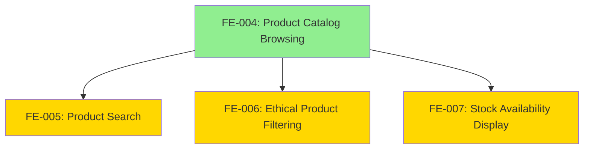

# 📘 Epic: Product Discovery & Catalog

---

## Epic Metadata

```yaml
epic_name: "Product Discovery & Catalog"
epic_id: "EPIC-002"
bounded_context: "Catalog"
status: "draft"
owner: "Catalog Team"
```

---

## Epic Overview

This epic enables users to discover and explore itsme.fashion's ethical beauty product catalog through browsing, search, and filtering capabilities. It showcases product transparency, ethical markers, and real-time stock availability.

**Strategic Importance:**
- Primary product discovery mechanism driving all conversions
- Showcases ethical positioning (KPI-004: 40% ethical product views)
- Foundation for cart and purchase flows
- Critical for mobile-first experience (KPI-003: 65% mobile transactions)

---

## Problem Statement

Users need effective ways to:
1. Browse products organized by category
2. Search for specific products by name or keyword
3. Filter by ethical markers (cruelty-free, vegan, paraben-free)
4. See real-time stock availability before adding to cart

Without robust product discovery, users cannot find products aligned with their values or needs, leading to low conversion and brand differentiation failure.

---

## Business Goals

| Goal | KPI | Target |
|------|-----|--------|
| Ethical product discovery | KPI-004 | 40% of sessions view ethical filtered pages |
| Mobile transaction share | KPI-003 | 65% mobile transactions |
| Page load performance | NFR-001 | <2s P95 page load time |
| Cart conversion | KPI-001 | 30% cart-to-purchase conversion |

---

## Features in This Epic

| Feature ID | Feature Name | Status | Dependencies | Priority |
|------------|--------------|--------|--------------|----------|
| FE-004 | Product Catalog Browsing | Draft | None | High (Foundational) |
| FE-005 | Product Search | Draft | FE-004 | High |
| FE-006 | Ethical Product Filtering | Draft | FE-004 | High |
| FE-007 | Stock Availability Display | Draft | FE-004 | High |

---

## Feature Dependency Graph



---

## Parallel Development Opportunities

**Must develop first:**
- FE-004 (Product Catalog Browsing) - foundational

**Can develop in parallel after FE-004:**
- FE-005 (Product Search)
- FE-006 (Ethical Product Filtering)
- FE-007 (Stock Availability Display)

---

## Feature Specifications

- [Product Catalog Browsing](../features/Catalog/product-catalog-browsing.md)
- Product Search - TBD
- Ethical Product Filtering - TBD
- Stock Availability Display - TBD

---

## Success Criteria

**Epic is complete when:**

1. ✅ Users can browse products by category (Skin Care, Hair Care, Cosmetics)
2. ✅ Users can search for products by name/keyword
3. ✅ Users can filter by ethical markers
4. ✅ Stock status displays in real-time on all product views
5. ✅ Page load times meet NFR-001 (<2s P95)
6. ✅ KPI-004 tracked: 40% sessions view ethical filtered pages
7. ✅ All features pass acceptance criteria
8. ✅ `ProductViewed` events emit correctly

---

## Technical Architecture Notes

**Bounded Context: Catalog**

**Core Aggregates:**
- `Product` - Product entity with metadata, pricing, stock
- `Category` - Product categorization

**Domain Events:**
- `ProductCreated` - New product added to catalog
- `ProductUpdated` - Product data modified
- `ProductOutOfStock` - Stock depleted
- `ProductViewed` - User viewed product (analytics)

**External Integrations:**
- Firestore (product catalog storage)
- Firebase Storage (product images)
- GraphQL Mesh (product queries)

---

## Dependencies on Other Epics

**This epic is foundational for:**
- Shopping Cart Epic (requires product data)
- Checkout Epic (requires stock validation)
- Wishlist Epic (requires product data)

**This epic depends on:**
- None (foundational)

---

## Rollout Strategy

**Week 1-2:** FE-004 (Product Catalog Browsing)  
**Week 2-3:** FE-005, FE-006, FE-007 in parallel  
**Week 3-4:** Limited Beta (10%)  
**Week 4-6:** General Availability (100%)

---

## History & Status

* **Status:** Draft
* **Epic Created:** 2025-12-30
* **Estimated Completion:** Week 6

---

> This epic document provides the strategic overview for all Catalog features.
