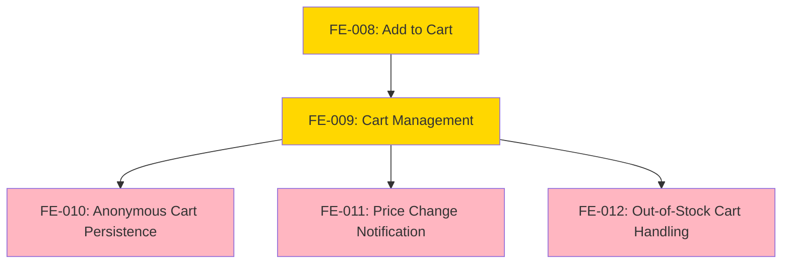

# 📘 Epic: Shopping Cart Management

---

## Epic Metadata

```yaml
epic_name: "Shopping Cart Management"
epic_id: "EPIC-003"
bounded_context: "Cart"
status: "draft"
owner: "Cart Team"
```

---

## Epic Overview

This epic enables users to collect products for purchase through comprehensive cart functionality, supporting both guest and authenticated users with server-side persistence, price change notifications, and stock management.

**Strategic Importance:**
- Critical conversion funnel between discovery and checkout
- Direct impact on KPI-001 (30% cart-to-purchase conversion)
- Supports mobile-first shopping with seamless cross-session persistence
- Reduces cart abandonment through intelligent notifications

---

## Problem Statement

Users need to:
1. Add products to cart and maintain them across sessions
2. Modify cart contents (update quantities, remove items)
3. Be notified of price changes before checkout
4. Be prevented from checking out with out-of-stock items
5. Experience seamless cart across guest and authenticated states

---

## Business Goals

| Goal | KPI | Target |
|------|-----|--------|
| Cart-to-purchase conversion | KPI-001 | 30% conversion rate |
| Checkout completion time | KPI-002 | <60s median |
| Cart abandonment tracking | Analytics | Enable recovery campaigns |

---

## Features in This Epic

| Feature ID | Feature Name | Status | Dependencies | Priority |
|------------|--------------|--------|--------------|----------|
| FE-008 | Add to Cart | Draft | FE-004, FE-007, FE-002 | High |
| FE-009 | Cart Management | Draft | FE-008 | High |
| FE-010 | Anonymous Cart Persistence | Draft | FE-002, FE-009 | High |
| FE-011 | Price Change Notification | Draft | FE-009 | Medium |
| FE-012 | Out-of-Stock Cart Handling | Draft | FE-009, FE-007 | High |

---

## Feature Dependency Graph



---

## Feature Specifications

- [Add to Cart](../features/Cart/add-to-cart.md)
- Cart Management - TBD
- Anonymous Cart Persistence - TBD
- Price Change Notification - TBD
- Out-of-Stock Cart Handling - TBD

---

## Success Criteria

1. ✅ Users can add, update, remove cart items
2. ✅ Carts persist for guests (30 days) and authenticated users (indefinitely)
3. ✅ Price changes trigger user notifications with confirmation required
4. ✅ Out-of-stock items block checkout until removed
5. ✅ `CartItemAdded`, `CartPriceChanged`, `CartAbandoned` events emit
6. ✅ Cart operations meet API performance (<500ms)

---

## Dependencies on Other Epics

**Depends on:**
- Identity Epic (FE-002 for guest sessions)
- Catalog Epic (FE-004, FE-007 for products and stock)

**Foundational for:**
- Checkout Epic (cart is input to checkout)

---

## History & Status

* **Status:** Draft
* **Epic Created:** 2025-12-30

