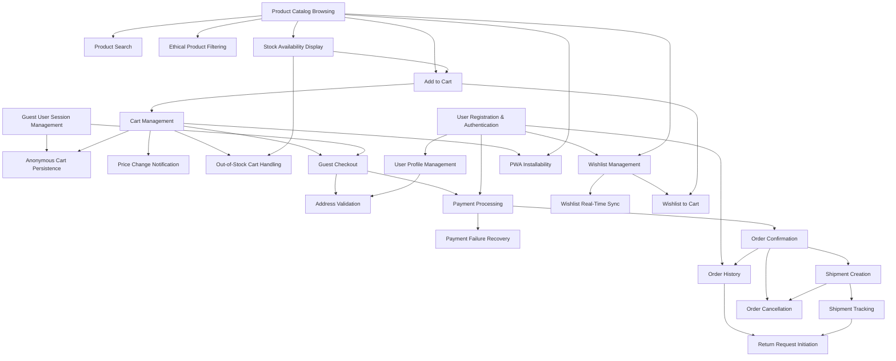

# itsme.fashion — Feature Roadmap

**Version:** `1.0.0` | **Status:** `Draft` | **Date:** `2025-12-30`

---

## Overview

This roadmap decomposes the itsme.fashion PRD into discrete, user-meaningful features mapped to bounded contexts. Each feature represents a distinct capability that delivers clear value and can be independently specified, developed, and launched.

---

## Bounded Context Mapping

Features are organized by DDD bounded contexts to enforce clear ownership and boundaries:

- **Identity** — User authentication and profile management
- **Catalog** — Product discovery, inventory, and metadata
- **Cart** — Shopping cart operations and session management
- **Checkout** — Order placement, payment, and guest flows
- **Fulfillment** — Shipment creation, tracking, and delivery
- **Wishlist** — Saved product management and cross-device sync

---

## Features

### Identity Context

#### Feature: User Registration & Authentication

- **Description:** Users can create accounts and authenticate using email/password via Firebase Authentication
- **Bounded Contexts:** Identity
- **Depends on:** None (foundational)
- **Outcome:** Users can securely create accounts and log in

#### Feature: Guest User Session Management

- **Description:** Anonymous users receive server-side sessions for cart and browsing continuity without authentication
- **Bounded Contexts:** Identity, Cart
- **Depends on:** None (foundational)
- **Outcome:** Users can shop without creating an account

#### Feature: User Profile Management

- **Description:** Authenticated users can view and update profile information and manage multiple shipping addresses
- **Bounded Contexts:** Identity
- **Depends on:** User Registration & Authentication
- **Outcome:** Users can maintain accurate personal and shipping information

---

### Catalog Context

#### Feature: Product Catalog Browsing

- **Description:** Users can browse products by category (skin care, hair care, cosmetics) with rich metadata including images, descriptions, and ingredient lists
- **Bounded Contexts:** Catalog
- **Depends on:** None (foundational)
- **Outcome:** Users can discover products through category navigation

#### Feature: Product Search

- **Description:** Users can search for products by name, category, or keywords
- **Bounded Contexts:** Catalog
- **Depends on:** Product Catalog Browsing
- **Outcome:** Users can quickly find specific products

#### Feature: Ethical Product Filtering

- **Description:** Users can filter products by ethical markers (cruelty-free, vegan, paraben-free) to align purchases with values
- **Bounded Contexts:** Catalog
- **Depends on:** Product Catalog Browsing
- **Outcome:** Users can discover products matching ethical preferences

#### Feature: Stock Availability Display

- **Description:** Users see real-time stock status (in stock / out of stock) for all products
- **Bounded Contexts:** Catalog
- **Depends on:** Product Catalog Browsing
- **Outcome:** Users know product availability before adding to cart

---

### Cart Context

#### Feature: Add to Cart

- **Description:** Users can add available products to their shopping cart
- **Bounded Contexts:** Cart, Catalog
- **Depends on:** Product Catalog Browsing, Stock Availability Display
- **Outcome:** Users can collect products for purchase

#### Feature: Cart Management

- **Description:** Users can view, update quantities, and remove items from their cart
- **Bounded Contexts:** Cart
- **Depends on:** Add to Cart
- **Outcome:** Users can modify cart contents before checkout

#### Feature: Anonymous Cart Persistence

- **Description:** Anonymous user carts persist server-side across sessions using session tokens
- **Bounded Contexts:** Cart, Identity
- **Depends on:** Guest User Session Management, Cart Management
- **Outcome:** Users retain cart contents without authentication

#### Feature: Price Change Notification

- **Description:** Users are notified when product prices in their cart change and must confirm before checkout
- **Bounded Contexts:** Cart, Catalog
- **Depends on:** Cart Management
- **Outcome:** Users are aware of price changes before purchase

#### Feature: Out-of-Stock Cart Handling

- **Description:** Users with out-of-stock items in cart are blocked from checkout until items are removed
- **Bounded Contexts:** Cart, Catalog
- **Depends on:** Cart Management, Stock Availability Display
- **Outcome:** Users cannot purchase unavailable products

---

### Checkout Context

#### Feature: Guest Checkout

- **Description:** Users can place orders without creating an account by providing shipping and payment details
- **Bounded Contexts:** Checkout, Identity
- **Depends on:** Cart Management, Guest User Session Management
- **Outcome:** Users can complete purchases without authentication

#### Feature: Address Validation

- **Description:** Shipping addresses are validated via Shiprocket serviceability check before order confirmation
- **Bounded Contexts:** Checkout, Fulfillment
- **Depends on:** Guest Checkout OR User Profile Management
- **Outcome:** Users only place orders to deliverable addresses

#### Feature: Payment Processing

- **Description:** Users can pay for orders securely via Cashfree (INR only) with PCI-DSS compliance
- **Bounded Contexts:** Checkout
- **Depends on:** Guest Checkout OR User Registration & Authentication
- **Outcome:** Users complete secure payment transactions

#### Feature: Payment Failure Recovery

- **Description:** Users can retry payment or change payment method when payment fails without losing order
- **Bounded Contexts:** Checkout
- **Depends on:** Payment Processing
- **Outcome:** Users recover from payment failures without re-entering order details

#### Feature: Order Confirmation

- **Description:** Users receive email confirmation and order summary immediately after successful payment
- **Bounded Contexts:** Checkout
- **Depends on:** Payment Processing
- **Outcome:** Users have proof of purchase and order details

---

### Fulfillment Context

#### Feature: Shipment Creation

- **Description:** Orders with confirmed payment automatically trigger shipment creation in Shiprocket
- **Bounded Contexts:** Fulfillment, Checkout
- **Depends on:** Order Confirmation
- **Outcome:** Orders are prepared for dispatch without manual intervention

#### Feature: Shipment Tracking

- **Description:** Users can view real-time shipment status and tracking link updated via Shiprocket webhooks
- **Bounded Contexts:** Fulfillment, Checkout
- **Depends on:** Shipment Creation
- **Outcome:** Users track their orders from dispatch to delivery

#### Feature: Order Cancellation

- **Description:** Users can cancel orders before shipment dispatch with automatic payment refund
- **Bounded Contexts:** Checkout, Fulfillment
- **Depends on:** Order Confirmation, Shipment Creation
- **Outcome:** Users can cancel orders they no longer want

---

### Order History & Returns

#### Feature: Order History

- **Description:** Authenticated users can view complete order history with status, items, and tracking information
- **Bounded Contexts:** Checkout
- **Depends on:** User Registration & Authentication, Order Confirmation
- **Outcome:** Users review past purchases and track current orders

#### Feature: Return Request Initiation

- **Description:** Users can initiate return requests for unopened products within 14 days of delivery
- **Bounded Contexts:** Checkout, Fulfillment
- **Depends on:** Order History, Shipment Tracking
- **Outcome:** Users can return products meeting return policy criteria

---

### Wishlist Context

#### Feature: Wishlist Management

- **Description:** Authenticated users can add, view, and remove products from their wishlist
- **Bounded Contexts:** Wishlist, Catalog
- **Depends on:** User Registration & Authentication, Product Catalog Browsing
- **Outcome:** Users save products for future purchase consideration

#### Feature: Wishlist Real-Time Sync

- **Description:** Wishlist changes are immediately synchronized across all logged-in devices
- **Bounded Contexts:** Wishlist, Identity
- **Depends on:** Wishlist Management
- **Outcome:** Users see consistent wishlist across devices

#### Feature: Wishlist to Cart

- **Description:** Users can move wishlist items directly to cart
- **Bounded Contexts:** Wishlist, Cart
- **Depends on:** Wishlist Management, Add to Cart
- **Outcome:** Users quickly convert saved items to purchases

---

### Progressive Web App (PWA)

#### Feature: PWA Installability

- **Description:** Users can install the platform as a Progressive Web App with offline cart viewing
- **Bounded Contexts:** All (frontend infrastructure)
- **Depends on:** Cart Management, Product Catalog Browsing
- **Outcome:** Users access the platform with app-like experience

---

## Feature Dependency Graph

---

## Feature Summary by Bounded Context

| Bounded Context             | Feature Count | Key Capabilities                                                          |
| --------------------------- | ------------- | ------------------------------------------------------------------------- |
| **Identity**                | 3             | Authentication, guest sessions, profile management                        |
| **Catalog**                 | 4             | Browse, search, ethical filtering, stock display                          |
| **Cart**                    | 5             | Add to cart, cart management, anonymous persistence, price/stock handling |
| **Checkout**                | 5             | Guest checkout, address validation, payment, recovery, confirmation       |
| **Fulfillment**             | 3             | Shipment creation, tracking, order cancellation                           |
| **Order History & Returns** | 2             | Order history, return initiation                                          |
| **Wishlist**                | 3             | Wishlist management, sync, cart integration                               |
| **PWA**                     | 1             | Installable web app with offline support                                  |

**Total Features:** 26

---

## Foundational Features (No Dependencies)

These features must be implemented first as they are dependencies for others:

1. User Registration & Authentication (Identity)
2. Guest User Session Management (Identity)
3. Product Catalog Browsing (Catalog)

---

## Notes

- All features are independently valuable and shippable
- Dependencies are explicit and directional
- Features map to bounded contexts for clear ownership
- No implementation details, priorities, or timelines are specified
- This roadmap is a planning artifact, not an execution schedule